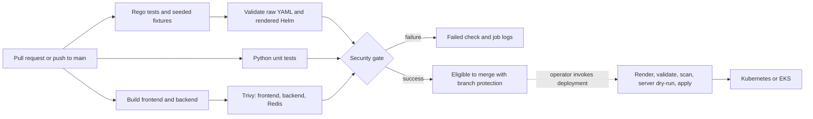

# SecureCICD

An educational prototype of **A Secure CI/CD Pipeline using GitHub Actions and
Open Policy Agent (OPA) for Kubernetes Applications**, by Hari Krishna Pokala.

The repository combines a frontend, Python voting API, and Redis with a GitHub
Actions security gate. Conftest evaluates Rego policies against Kubernetes YAML
and rendered Helm templates; Trivy scans all three container images.

**Status:** code-only prototype. The application, policies, tests, container builds,
and deployment commands have **not been executed or runtime-validated** during
creation. The paper's 100% detection and +14-second overhead are reported research
results, not measurements of this repository. No cloud resources are provisioned
and nothing has been published to GitHub by creating these files.

## Architecture



At runtime: browser → Nginx frontend → Flask/Gunicorn backend → Redis. The demo
allows repeat votes, has no authentication, and intentionally keeps votes in
memory. Services are internal; access the frontend through localhost or port-forwarding.

## Start here

See **[execution instructions](docs/execution.md)** for prerequisites and complete
commands. Docker with Compose v2, Bash, Make, and Python 3.11+ cover the local demo
and policy checks. Policy tools run in versioned Docker images; no local OPA,
Conftest, Helm, or Trivy installation is required.

```bash
# These commands are for you to run when ready, from the repository root.
make check     # Rego tests, 10 negative cases, raw manifests, Helm rendering
make up        # Build and start the voting demo
# Open http://localhost:8080
make down      # Stop the demo; in-memory votes are lost
```

`make check` needs network access to pull tool images initially. `make up` does
not enforce the security gate; use `make scan` to build and scan images separately.
Scanning can fail on real HIGH/CRITICAL findings, including vulnerabilities with
no available fix. This is deliberate fail-closed behavior, not a promised green build.

## Contents

| Path | Purpose |
| --- | --- |
| `app/frontend/` | Static voting UI, Nginx proxy, non-root Dockerfile |
| `app/backend/` | Flask API, atomic Redis voting, unit tests, Dockerfile |
| `compose.yaml` | Local three-service demo, frontend bound to loopback |
| `k8s/` | Raw deployments, services, namespace, service account, network policies |
| `charts/voting-app/` | Equivalent Helm chart with configurable images and resources |
| `policies/` | Rego v1 enforcement and unit tests |
| `tests/fixtures/` | One positive and ten independently seeded negative manifests |
| `scripts/` | Policy checks, fixture runner, image scanning, gated manual deployment |
| `.github/workflows/` | PR/main CI and aggregate required check |
| `docs/` | Execution, paper mapping, policy behavior, EKS, and publication |

## Security rules

| ID | Rule |
| --- | --- |
| SC001 | Require explicit non-`latest` image tags or SHA256 digests |
| SC002 | Restrict images to exact approved repository names |
| SC003 | Require CPU and memory requests and limits |
| SC004 | Prohibit privileged containers |
| SC005 | Require `allowPrivilegeEscalation: false` |
| SC006 | Require effective `runAsNonRoot: true`; prohibit effective UID 0 |
| SC007 | Prohibit host network, PID, and IPC namespaces |
| SC008 | Require a read-only root filesystem |

Rules inspect Pods, common workload controllers, CronJobs, and Kubernetes Lists.
Container checks include init containers and ephemeral containers; the resource
rule excludes ephemeral containers because Kubernetes forbids their resources.
See [policy scope and limitations](docs/policies.md).

## Public repository setup

Follow [publishing instructions](docs/publishing.md) to create your public GitHub
repository and require the **Security gate** check. Failed workflows alone do not
block merging without a branch rule. The workflow uses a read-only token and
does not post PR comments or receive AWS credentials.

The newly authored code is MIT licensed. The source PDF is excluded by `.gitignore`;
the code license does not license the paper or third-party dependencies.

## References

- [Paper-to-code mapping and differences](docs/paper-mapping.md)
- [Conftest installation](https://www.conftest.dev/install/) and [options](https://www.conftest.dev/options/)
- [Helm template command](https://helm.sh/docs/helm/helm_template/)
- [Trivy image scanner](https://trivy.dev/docs/dev/references/configuration/cli/trivy_image/)
- [Optional EKS/ECR instructions](docs/aws.md)
